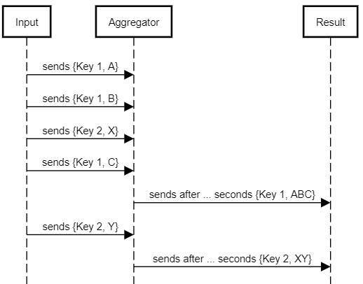

# MassiveUpdatesAggregator
Allowsеs to group incoming messages by key and returns aggregations by timer.



### Example

```C#
public record TestData(int Key, string Value) : IAggregatorItem<int>;

/// <summary>
/// This class implements aggregation strategy for bunch of data
/// </summary>
public class SumStrategy : IAggregationStrategy<TestData, int>
{
    public TestData Merge(IEnumerable<TestData> items)
    {
        // Simple strategy - just create new item with key and contact of all values
        var key = items.First().Key;
        return new TestData(Key: key, Value: string.Join("-", items.Select(x => x.Value)));
    }
}

class Program
{
    static async Task Main(string[] args)
    {
        var testData = "The quick brown fox jumps over the lazy dog".Split(" ");

        CancellationTokenSource cts = new CancellationTokenSource();
        var rnd = new Random();

        // Creation of the aggregator class
        var aggregator = new Aggregator<TestData, int>(initialSize: 100, millisecondsDelay: 1000, new SumStrategy(), cts.Token);

        bool isWork = true;
        int i = 0;

        _ = Task.Run(async () =>
        {
            while (isWork)
            {
                await Task.Delay(100 * rnd.Next(1, 7));
                // Send data for key = 1  
                await aggregator.SendAsync(new TestData(Key: 1, Value: testData[i++]));
                if (i == testData.Length)
                    i = 0;
            }
        });

        _ = Task.Run(async () =>
        {
            // Iterate aggregated items
            await foreach (var item in aggregator.WithCancellation(cts.Token))
            {
                Console.WriteLine($"{item.Key} {item.Value}");
            }
        });

        Console.ReadKey();
        cts.Cancel();
        isWork = false;
        try
        {
            // Stop aggregator
            await aggregator.StopAsync();
        }
        catch (TaskCanceledException)
        {

        }

        Console.WriteLine("All done");
    }
}
```
#### output 

```
1 The-quick-brown-fox
1 jumps-over-the-lazy
1 dog-The-quick
1 brown-fox-jumps
1 over-the-lazy
1 dog-The-quick
1 brown-fox
1 jumps-over-the
1 lazy-dog
1 The-quick
1 brown-fox-jumps-over
All done
```
